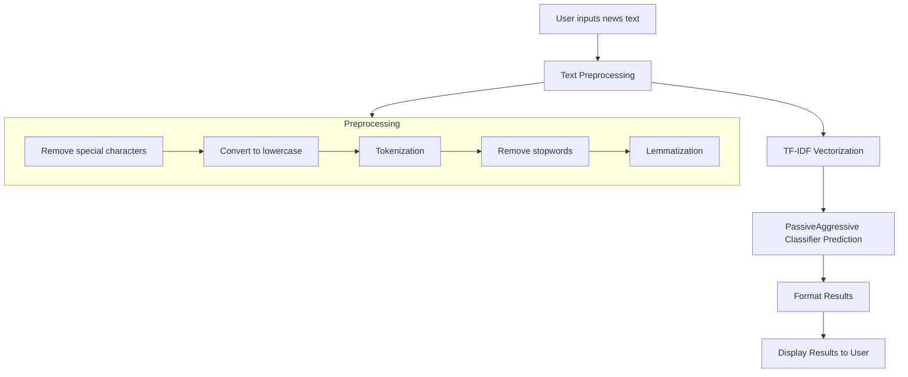

# Fake News Detection using Machine Learning

A web application that uses machine learning to detect whether news articles are real or fake.

## Project Overview

This project implements a fake news detection system using Natural Language Processing (NLP) and Machine Learning techniques. The system is deployed as a Flask web application where users can input news text, and the application will predict whether the news is likely real or fake.

## Features

- Text preprocessing using NLTK
- Machine learning classification using PassiveAggressiveClassifier
- User-friendly web interface
- Real-time prediction

## Technologies Used

- Python
- Flask
- NLTK (Natural Language Toolkit)
- Scikit-learn
- Pandas
- Pickle (for model serialization)

## Project Structure

```
Fake-News-Detection-using-MachineLearning/
├── app.py                  # Main Flask application
├── model.pkl               # Trained machine learning model
├── vector.pkl              # TF-IDF vectorizer
├── static/                 # CSS, JS, and image files
├── templates/              # HTML templates
│   ├── index.html          # Home page
│   ├── prediction.html     # Results page
│   ├── about.html          # About page
│   └── Contact.html        # Contact page
└── requirements.txt        # Project dependencies
```

## Flowchart



## Setup and Installation

1. Clone the repository
2. Install the required packages:
   ```
   pip install -r requirements.txt
   ```
3. Run the application:
   ```
   python app.py
   ```
4. Open your browser and navigate to `http://127.0.0.1:5000/`

## How It Works

1. User inputs news text through the web interface
2. The application preprocesses the text:
   - Removes special characters
   - Converts to lowercase
   - Tokenizes the text
   - Removes stopwords
   - Applies lemmatization
3. The preprocessed text is vectorized using TF-IDF
4. The machine learning model predicts whether the news is real or fake
5. The prediction result is displayed to the user

## Model Training

The model was trained on a dataset of labeled news articles. The PassiveAggressiveClassifier was chosen for its effectiveness in text classification tasks and its ability to handle large datasets efficiently.

## Future Improvements

- Implement more advanced NLP techniques
- Add support for multiple languages
- Improve the user interface
- Add explanation for why news was classified as fake or real

## Contributors

[Your Name]

## License

[License Information]
